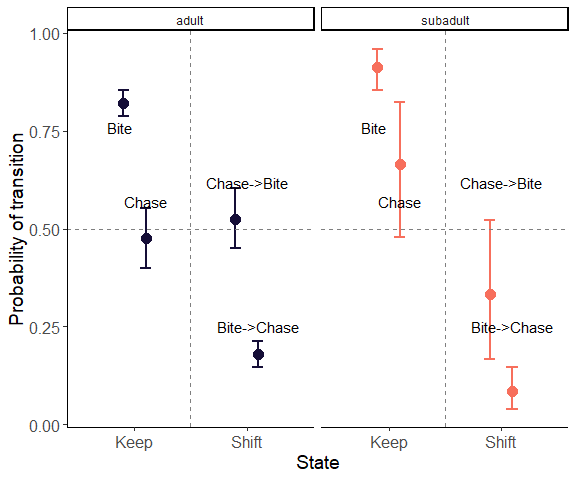

Stegastes fuscus behavior
================
2023-03-02

Behavior of *Stegastes fuscus* in three different reef sites found
around the CEBIMar, São Sebastião, São Paulo, BR. We tested whether the
relationship between \# chases and \# bites differed between adults and
subadults, and whether the transitions between these behaviors changed
across sites.

<!-- README.md is generated from README.Rmd. Please edit that file -->
<!-- badges: start -->
<!-- badges: end -->

We ran two state-space models to estimate the transition rates between
the following levels: model 1: probability of keep biting (parameter
phi), probability of shift from chase to bite (parameter gamma); model
2: probability of keep chasing (phi), and probability of shift from bite
to chase (phi). PS: The correct model would be a multi-state model where
all these probabilities could be estimated in one unique model (had no
time to implement it). Each model has the following structure:


        model {
        
        ############ Priors
        
        for (i in 1:nsite){
          gamma[i]~dunif (0,1) # parameter of state transition
          phi[i]~dunif (0,1) # parameter of state persistence
          }
        
        ############ Model ########################
        for (i in 1:nind){
        
            for (t in 2:n_seq){
        
                ### dynamic model
                ### defining occupancy probability  ###
                muZ[i,t] <- y[i,t-1] * (phi[site[i]]) + ### if bite, p of persist biting
                            (1-y[i,t-1]) * gamma[site[i]]  ###  if chase, p of shifting to bite
                            
                y[i,t] ~ dbern(muZ[i,t])
        
            }#t
        }#i
        
        # derived parameters
        av_gamma <- mean(gamma)
        av_phi <- mean(phi)
        
        
        }## end of the model
        
        

And the resulting transition rates between behavioral states (chase and
bites) were:



Useful summary statistics

``` r
summary_stats
```


Relationship between foraging (bites) and persecution (chases) rates,
for adult and subadult damsel fish.

``` r
plot_cor
```


The composition of chased species

``` r
plot_freq_chased
```


<!-- badges: start -->
<!-- badges: end -->

#### These results were produced using the following software and associated packages:

    ## R version 4.2.2 (2022-10-31 ucrt)
    ## Platform: x86_64-w64-mingw32/x64 (64-bit)
    ## Running under: Windows 10 x64 (build 19044)
    ## 
    ## Matrix products: default
    ## 
    ## locale:
    ## [1] LC_COLLATE=Portuguese_Brazil.utf8  LC_CTYPE=Portuguese_Brazil.utf8   
    ## [3] LC_MONETARY=Portuguese_Brazil.utf8 LC_NUMERIC=C                      
    ## [5] LC_TIME=Portuguese_Brazil.utf8    
    ## 
    ## attached base packages:
    ## [1] stats     graphics  grDevices utils     datasets  methods   base     
    ## 
    ## other attached packages:
    ## [1] ggplot2_3.4.0     reshape_0.8.9     here_1.0.1        coda_0.19-4      
    ## [5] jagsUI_1.5.2.9002 tidyr_1.3.0       dplyr_1.1.0       lubridate_1.9.1  
    ## [9] readxl_1.4.1     
    ## 
    ## loaded via a namespace (and not attached):
    ##  [1] Rcpp_1.0.10       highr_0.10        plyr_1.8.8        cellranger_1.1.0 
    ##  [5] pillar_1.8.1      compiler_4.2.2    tools_4.2.2       digest_0.6.31    
    ##  [9] nlme_3.1-160      viridisLite_0.4.1 gtable_0.3.1      evaluate_0.20    
    ## [13] lifecycle_1.0.3   tibble_3.1.8      timechange_0.2.0  lattice_0.20-45  
    ## [17] mgcv_1.8-41       pkgconfig_2.0.3   rlang_1.0.6       Matrix_1.5-1     
    ## [21] cli_3.6.0         rstudioapi_0.14   yaml_2.3.7        parallel_4.2.2   
    ## [25] xfun_0.36         fastmap_1.1.0     withr_2.5.0       knitr_1.42       
    ## [29] generics_0.1.3    rjags_4-13        vctrs_0.5.2       rprojroot_2.0.3  
    ## [33] grid_4.2.2        tidyselect_1.2.0  glue_1.6.2        R6_2.5.1         
    ## [37] fansi_1.0.4       rmarkdown_2.20    farver_2.1.1      purrr_1.0.1      
    ## [41] magrittr_2.0.3    splines_4.2.2     scales_1.2.1      htmltools_0.5.4  
    ## [45] colorspace_2.1-0  labeling_0.4.2    utf8_1.2.2        munsell_0.5.0
