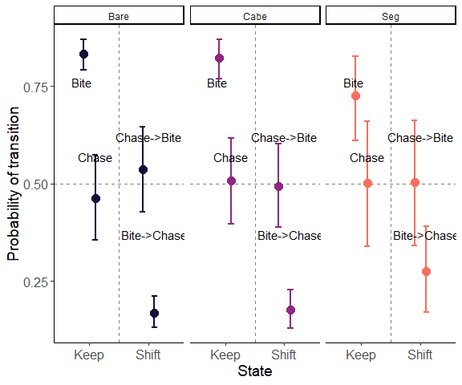

Stegastes fuscus behavior
================
2023-03-02

Behavior of *Stegastes fuscus* in three different reef sites found
around the CEBIMar, São Sebastião, São Paulo, BR

<!-- README.md is generated from README.Rmd. Please edit that file -->
<!-- badges: start -->
<!-- badges: end -->

    ## List of 3
    ##  $ y    :List of 6
    ##  $ 1: num [1:11] 1 0 0 0 0 1 1 1 1 1 ...
    ##  $ 2: num [1:11] NA 1 1 1 1 0 0 0 0 0 ...
    ##  $ 3: num [1:11] NA 0 0 0 0 1 1 1 1 1 ...
    ##  $ 4: num [1:11] NA NA 1 NA NA 0 0 0 NA 0 ...
    ##  $ 5: num [1:11] NA NA 0 NA NA 1 1 1 NA NA ...
    ##  $ 6: num [1:11] NA NA 1 NA NA NA 0 NA NA NA ...
    ##  - attr(*, "row.names")= int [1:11] 1 2 3 4 5 6 7 8 9 10 ...
    ##  $ nind : int 11
    ##  $ n_seq: int 6
    ## 
    ## Processing function input....... 
    ## 
    ## Converting data frame 'y' to matrix.
    ## 
    ## Done. 
    ##  
    ## Compiling model graph
    ##    Resolving undeclared variables
    ##    Allocating nodes
    ## Graph information:
    ##    Observed stochastic nodes: 33
    ##    Unobserved stochastic nodes: 44
    ##    Total graph size: 213
    ## 
    ## Initializing model
    ## 
    ## Adaptive phase..... 
    ## Adaptive phase complete 
    ##  
    ## 
    ##  Burn-in phase, 2000 iterations x 3 chains 
    ##  
    ## 
    ## Sampling from joint posterior, 2000 iterations x 3 chains 
    ##  
    ## 
    ## Calculating statistics....... 
    ## 
    ## Done.

<!-- badges: start -->
<!-- badges: end -->

#### This map was produced using the following software and associated packages:

    ## R version 4.2.2 (2022-10-31 ucrt)
    ## Platform: x86_64-w64-mingw32/x64 (64-bit)
    ## Running under: Windows 10 x64 (build 19044)
    ## 
    ## Matrix products: default
    ## 
    ## locale:
    ## [1] LC_COLLATE=Portuguese_Brazil.utf8  LC_CTYPE=Portuguese_Brazil.utf8   
    ## [3] LC_MONETARY=Portuguese_Brazil.utf8 LC_NUMERIC=C                      
    ## [5] LC_TIME=Portuguese_Brazil.utf8    
    ## 
    ## attached base packages:
    ## [1] stats     graphics  grDevices utils     datasets  methods   base     
    ## 
    ## other attached packages:
    ## [1] ggplot2_3.4.0     coda_0.19-4       jagsUI_1.5.2.9002 reshape_0.8.9    
    ## [5] dplyr_1.1.0       lubridate_1.9.1   readxl_1.4.1     
    ## 
    ## loaded via a namespace (and not attached):
    ##  [1] Rcpp_1.0.10      highr_0.10       cellranger_1.1.0 pillar_1.8.1    
    ##  [5] compiler_4.2.2   plyr_1.8.8       tools_4.2.2      digest_0.6.31   
    ##  [9] gtable_0.3.1     evaluate_0.20    lifecycle_1.0.3  tibble_3.1.8    
    ## [13] timechange_0.2.0 lattice_0.20-45  pkgconfig_2.0.3  rlang_1.0.6     
    ## [17] cli_3.6.0        rstudioapi_0.14  yaml_2.3.7       parallel_4.2.2  
    ## [21] xfun_0.36        fastmap_1.1.0    withr_2.5.0      knitr_1.42      
    ## [25] generics_0.1.3   rjags_4-13       vctrs_0.5.2      grid_4.2.2      
    ## [29] tidyselect_1.2.0 glue_1.6.2       R6_2.5.1         fansi_1.0.4     
    ## [33] rmarkdown_2.20   farver_2.1.1     magrittr_2.0.3   scales_1.2.1    
    ## [37] htmltools_0.5.4  colorspace_2.1-0 labeling_0.4.2   utf8_1.2.2      
    ## [41] munsell_0.5.0
